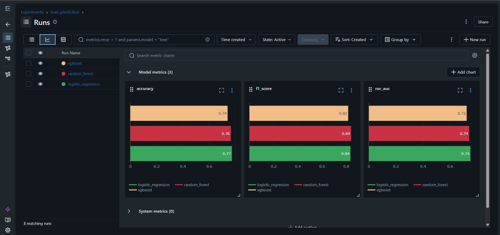
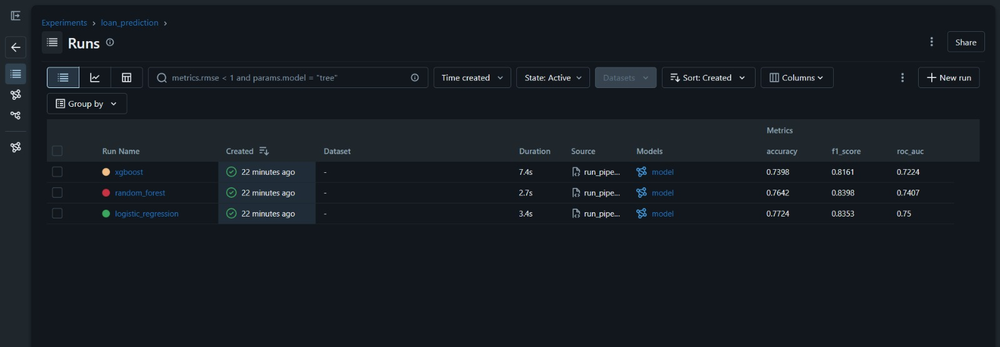
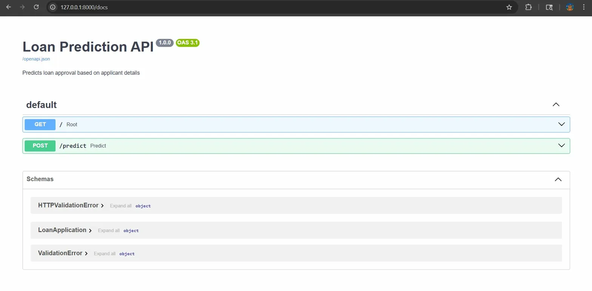
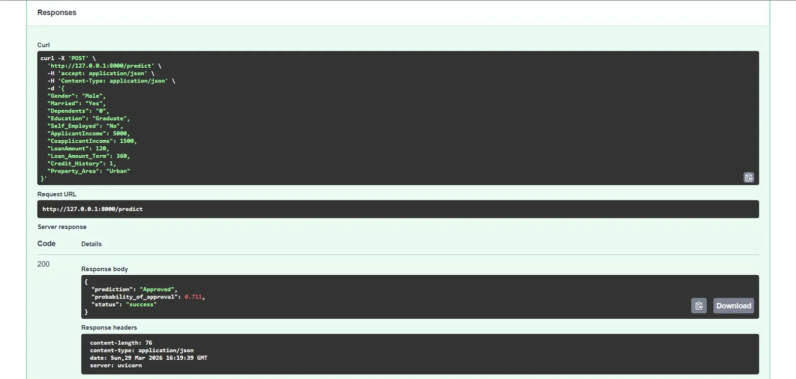

# Loan Prediction MLOps Pipeline

An end-to-end machine learning pipeline that predicts loan approval status,
built with production MLOps practices — experiment tracking, reproducible
pipelines, structured logging, and config-driven training.

---

## Demo

> 🚀 Live demo coming in Phase 3 — FastAPI + Streamlit deployment

---

## Project Structure
```
loan-prediction/
├── data/
│   └── sample_data.csv        # raw dataset (614 rows, 13 columns)
├── src/
│   ├── data_loader.py         # load, validate, split data
│   ├── preprocessing.py       # sklearn ColumnTransformer pipeline
│   ├── train.py               # model training + pipeline building
│   ├── evaluate.py            # metrics — accuracy, F1, ROC-AUC
│   └── logger.py              # structured timestamped logging
├── scripts/
│   └── run_pipeline.py        # main entry point — runs full pipeline
├── configs/
│   └── config.yaml            # all parameters in one place
├── artifacts/
│   └── best_model.pkl         # saved best model
├── logs/                      # auto-generated run logs
├── requirements.txt
└── README.md
```

---

## Problem Statement

Predict whether a loan application will be approved (Y) or rejected (N)
based on applicant demographics, income, credit history, and loan details.

**Dataset:** Loan Prediction Dataset — 614 rows, 12 features, binary target  
**Type:** Binary Classification  
**Target:** `Loan_Status` — Y (approved) / N (rejected)

---

## Features

| Feature | Type | Description |
|---|---|---|
| Gender | Categorical | Male / Female |
| Married | Categorical | Applicant marital status |
| Dependents | Categorical | Number of dependents |
| Education | Categorical | Graduate / Not Graduate |
| Self_Employed | Categorical | Self employed status |
| ApplicantIncome | Numeric | Monthly applicant income |
| CoapplicantIncome | Numeric | Monthly co-applicant income |
| LoanAmount | Numeric | Loan amount (thousands) |
| Loan_Amount_Term | Numeric | Term of loan (months) |
| Credit_History | Numeric | Credit history meets guidelines |
| Property_Area | Categorical | Urban / Semi-Urban / Rural |

---

## MLOps Stack

| Tool | Purpose |
|---|---|
| `scikit-learn Pipelines` | Preprocessing + model as one object |
| `MLflow` | Experiment tracking, metric logging, model registry |
| `PyYAML` | Config-driven training — no hardcoded parameters |
| `logging` | Structured timestamped logs for every run |
| `pickle` | Model serialization |
| `Git` | Version control |

---

## Experiment Results

All experiments tracked with MLflow. Three models compared on the same
train/test split (80/20, random_state=42).

| Model | Accuracy | ROC-AUC | F1 Score |
|---|---|---|---|
| **Logistic Regression** | **77.2%** | **0.750** ✓ | **0.835** |
| Random Forest | 76.4% | 0.741 | 0.840 |
| XGBoost | 73.9% | 0.722 | 0.816 |

**Best model: Logistic Regression** — ROC-AUC: 0.750

> Logistic Regression outperformed tree-based models on this dataset,
> consistent with expected behaviour on small tabular datasets (614 rows)
> where simpler models generalise better.

### MLflow Dashboard


---

## Preprocessing Pipeline

Handled using `sklearn.pipeline.Pipeline` + `ColumnTransformer`:

- **Numeric features** — median imputation → standard scaling
- **Categorical features** — mode imputation → one-hot encoding
- **Dropped** — `Loan_ID` (identifier, no predictive value)
- **Missing values handled** — 6 columns had missing data
  (Credit_History: 50, Self_Employed: 32, LoanAmount: 22, etc.)

---

### MLflow Dashboard


## API


### Sample Prediction


## How to Run

**1. Clone the repo**
```bash
git clone https://github.com/YOUR_USERNAME/loan-prediction.git
cd loan-prediction
```

**2. Create virtual environment**
```bash
python3 -m venv .venv
source .venv/bin/activate
```

**3. Install dependencies**
```bash
pip install -r requirements.txt
```

**4. Run the full pipeline**
```bash
python scripts/run_pipeline.py
```

**5. View MLflow dashboard**
```bash
mlflow ui --backend-store-uri sqlite:///mlflow.db
# open http://127.0.0.1:5000
```

---

## Key Findings

- **Credit History** is the strongest predictor — applicants with good
  credit history have significantly higher approval rates
- **Class imbalance** — 69% approved vs 31% rejected; model shows bias
  toward approvals which is realistic for lending datasets
- **Simple models win on small data** — Logistic Regression outperformed
  Random Forest and XGBoost, demonstrating the importance of model
  selection based on dataset size

---

## Roadmap

- [x] Phase 1 — End-to-end ML pipeline
- [x] Phase 2 — MLflow experiment tracking
- [ ] Phase 3 — FastAPI deployment + Docker
- [ ] Phase 4 — CI/CD with GitHub Actions

---

## Author

**Arrohi Srivastava**  
[GitHub](https://github.com/arrohisrivastava0) · [LinkedIn](https://www.linkedin.com/in/arrohi-srivastava/)